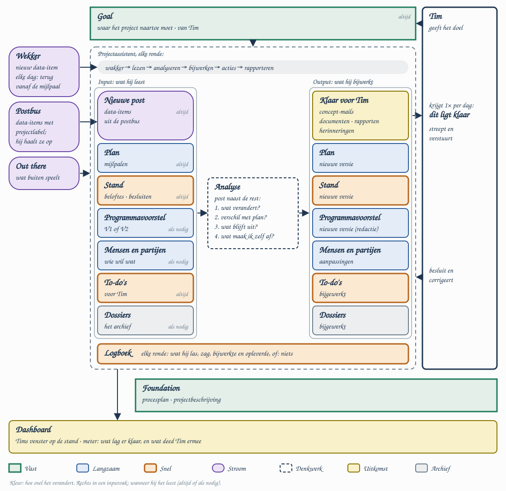

# Project Manager

Experiment: een AI-projectassistent die zelf werk aflevert in plaats van op Tim te wachten.
Eerst Melk en Meer; daarna Visie op Noordeloos, JUMP en La Grange.

## Waarom de huidige niets oplevert
- Hij mag alleen lijsten bijhouden; voor al het andere vraagt hij toestemming.
- Zijn doelen kan alleen Tim halen.
- Hij wordt wakker met "is er nieuwe mail?". Meestal is het antwoord nee, en dan stopt hij.
- De bal ligt overal bij Tim.

## Wat hem proactief maakt
Een trigger, een product dat bij die trigger hoort, en ruimte om het zonder Tim af te maken.
Elke ronde begint bij een trigger: een nieuw data-item, of elke dag terug vanaf de mijlpaal.
- Maken mag altijd; versturen nooit zonder Tim.
- Mist er een besluit, dan schrijft hij op zijn eigen advies door en markeert hij dat. Tim streept.
- Eén keer per dag één bericht: dit ligt klaar.

## Opbouw


1. **Verzamelen en routeren**: de data-collector haalt alle bronnen op en legt elk stuk in de postbus van het project. Eerst vaste regels, daarna Jev, de rest naar een twijfelbak. Dit bouwt pilot-experiment-2.
2. **Analyse**: bij elk stuk de vraag "wat verandert hierdoor?". Daarnaast elke dag een ronde: wat blijft uit, wat loopt achter op de planning?
3. **Uitkomst**:
   - de to-do's: afspraken dat anderen iets doen, wie doet wat en wanneer (een herinnering staat eerst als concept klaar); Tims eigen to-do's staan in Todoist, daar leest hij ze en daar past hij ze aan;
   - de planning: deadlines, mijlpalen en wat verder op tijd moet;
   - een nieuwe versie van het project plan, het uitgebreide plan in tekst;
   - een dashboard dat eerst laat zien wat er klaarligt.

## Lijsten van het project
- **Lijsten van het project**:
  - de threads (`threads.md`): onderwerpen die een tijd doorlopen, elk met een eigenaar, een volgende stap en een datum;
  - het doel en de planning;
  - de besluiten, open en genomen, met de reden (dit blokje heette eerst Stand; beloftes van anderen zijn to-do's);
  - het project plan;
  - de mensen en partijen, met wat ze willen en hoe hun naam ook geschreven of verstaan wordt.
- **Bij elke regel**: bron en datum, feit of aanname, en bij wie de bal ligt.
- **Voor de AI zelf**: zijn eigen logboek (`log.md`), de spelregels (in het protocol), en wat we niet weten en de correcties van Tim (`notes.md`).

## Het logboek
Eén logboek voor alles, één regel per ronde, in zes vaste vakjes: 1 trigger (waardoor), 2 gelezen (welke data-items), 3 gezien (de vier vragen: wat verandert, verschil met de planning, wat blijft uit, wat maak ik zelf af), 4 bijgewerkt (welke regel waar), 5 klaargelegd (wat, voor Tim), 6 Tim deed (wat Tim sinds de vorige ronde deed: streepte, verstuurde, corrigeerde, met een verwijzing naar het voorstel). Tims antwoord zelf staat in het voorstelbestand.
Er komt alleen bij; "niets gevonden" is ook een regel. Het verwijst naar de lijsten en kopieert niet. De volgende ronde begint bij de laatste regel.

## Op GitHub
- Eén map met projecten; elk project is één repo. Geen repo per onderdeel.
- Elk blokje van de tekening is een map of bestand in die repo.
- Eén ronde is één commit; de diff is wat de analyse veranderde.
- Geen pull requests. De snelle lijsten (besluiten, to-do's, mensen, logboek) wijzigt hij direct. Voor de planning en het project plan legt hij een voorstel klaar; de wijziging komt pas na Tims ja. Foundation is alleen van Tim.
- Het dashboard is een viewer op alle onderdelen, een HTML-pagina die de repo leest; Tim hoeft GitHub niet in.
- Buiten de repo: de postbus (data-items liggen bij de data-collector), de dossiers (blijven op Desk; hij leest ze en werkt ze zelf bij, en meldt dat in het logboek: trede 3, zie B30) en Tims to-do's (in Todoist; een wijziging daar komt als data-item via de post binnen).

## De projectenmap
De machinerie staat één keer, als competence in Superpak (B40); elk project is een repo met alleen inhoud. Alle projecten draaien dezelfde versie. De namen zijn werknamen (zie Open).

```
superpak-clean/40-competences/assist-project/   de engine: één keer, voor alle projecten
├── assist-project.card.md  de kaart; elk project is een instelling ervan
├── PROTOCOL.md             hoe een ronde gaat: kringloop, de vier vragen, logboek, wat mag
├── skills/                 per onderdeel één: hoe het gevuld wordt, in welke vorm, wat er niet in hoort
│   ├── new-project.md      kopieert de template, vraagt Tim doel, fundament en sturing
│   └── threads.md · decisions.md · planning.md · people.md · todos.md · project-plan.md · preparations.md · log.md · analysis.md
├── template/               het lege project: elke map en elk bestand, met kort wat erin hoort
├── bin/
│   ├── round.sh            start een verse sessie: "volg PROTOCOL.md voor projects/<naam>"
│   ├── check.sh            de controle na de ronde: schrijver per bestand en de vorm uit de skill
│   └── build-viewer.sh     bouwt het dashboard (HTML) uit de projectrepo
└── viewer/                 het sjabloon van de HTML-pagina

projects/
├── melk-en-meer/           één repo per project, geen script
│   ├── foundation/         van Tim: goal.md (het doel), process.md (het proces), projectbeschrijving
│   ├── instructions.md     van Tim: de projectsturing (postbusadres, ritme, mijlpaal, bronnen)
│   ├── threads.md · planning.md · decisions.md · people.md · todos.md · log.md
│   ├── notes.md            voor de AI zelf: wat we niet weten, de correcties van Tim
│   ├── project-plan/       het uitgebreide plan in tekst, per versie
│   └── preparations/       wat klaarligt voor Tim: één bestand per voorstel, met status
├── la-grange/              zelfde opbouw
└── visie-op-noordeloos/
```

- **Protocol, skills, template.** Het protocol zegt wanneer hij een onderdeel bijwerkt, de skill zegt hoe. Een nieuw project is de template kopiëren; het protocol begint bij een project zonder logboekregel met de skill `new-project`.
- **Projectsturing.** Wat per project anders is staat in `instructions.md`; het protocol leest dat als eerste.
- **Trigger.** Twee wekkers op de Mini, die alleen een ronde voor één project starten: het event `intake.project arrives` in `604-trigger-activator` bij een nieuw data-item met projectlabel, en een dagronde per project via `613-round-starter` op het ritme uit `instructions.md` (B41).
- **Wie schrijft.** `foundation/` en `instructions.md` zijn van Tim; de rest van de assistent; in `preparations/` maakt hij het bestand en schrijft Tim de status. `check.sh` kijkt het na.

## Spelregels
Overgenomen uit Tims tekst "Inrichting op GitHub" van 06-10-2026.
1. **Eén schrijver per bestand.** Per bestand staat vast wie erin schrijft (de assistent, Tim). Een controle na elke ronde weigert als de assistent een bestand raakt dat niet van hem is, zoals foundation.
2. **Inhoud en machinerie gescheiden.** De project-repo bevat alleen inhoud: plan, besluiten, logboek. Protocol, viewer-bouwer en controles staan één keer apart (de engine, in Superpak); alle projecten draaien dezelfde versie (B40).
3. **Een voorstel is een bestand met een status.** Wat klaarligt voor Tim is één bestand per voorstel, met de precieze wijziging en een status: open, ja, pas aan, nee, doorgevoerd. Tims antwoord wordt erin geschreven; een nee blijft staan met de reden, zodat het niet terugkomt. Bij ja verandert de volgende ronde het echte bestand en noemt de commit het voorstel en wie besloot.
4. **Het protocol staat in de repo.** De trigger zegt alleen: volg het protocol. Alles wat een ronde moet doen staat in dat ene bestand; de werkwijze veranderen is een bestand veranderen, met geschiedenis.
5. **Out there heeft een weekritme.** Eén keer per week naar buiten kijken, begrensd, met hooguit één voorstel.
6. **Twee mensen bij de knoppen.** Alles hangt nu aan Tim; er is altijd een reserve die erbij kan. Dit is een afspraak, geen bouwpunt.

## Besluiten
Alle besluiten, genomen en open, staan in [decisions.md](decisions.md), in de vorm die elk project krijgt.
